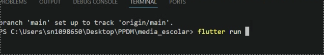

## Atividade - Calculadora de Média Escolar

### Objetivo:

Desenvolver uma aplicação Flutter,capaz de receber o nome e 3 notas de um aluno, calcular sua média e apresentar a situação escolar


### Conceitos 

- MaterialApp
- Scaffold
- StatefulWidget
- TextField
- TextEditingController
- ElevatedButton
- SetState
- Variaveis
- Conversão de texto para número
- Condicionais
- Funções
- Validação de Campos
- SnackBar


### Criar o Projeto Flutter

Abra o terminal e execute 

```bash 
    flutter create media_escolar
```

Entre na pasta do projeto:
```bash 
    cd media_escolar
```

Abra o projeto no Visual Studio Code:
```bash 
    code .
```

Execute o Projeto:
```bash 
    flutter run dev
```

Resultado:




### Checklist

- [ x ] Criar o Projeto Flutter
- [   ] Criar o campo de nome
- [   ] Criar os três campos de nota
- [   ] Criar o botão Calcular
- [   ] Calcular média
- [   ] Verificar a situação do aluno
- [   ] Criar Mostrar o resultado
- [   ] Criar o botão limpar
- [   ] Validar notas entre 0 e 10 
- [   ] Testar o Aplicativo